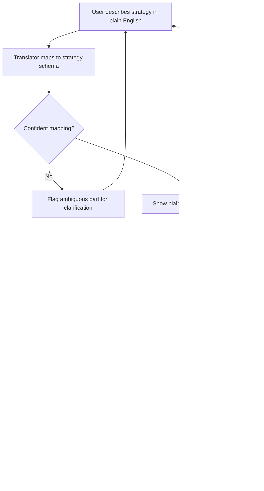
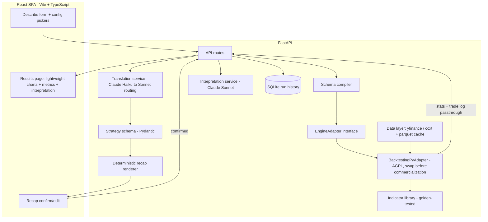
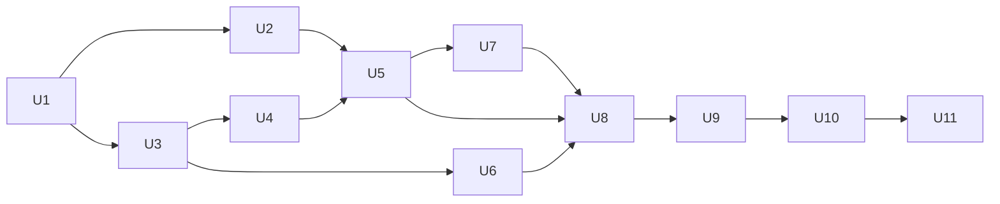

# AI Strategy Backtesting Platform - Plan

## Goal Capsule

- **Objective:** Ship a personal-use web app that turns a natural-language trading strategy description into a trustworthy backtest — accurate metrics, faithful strategy translation — with interactive chart review and AI-generated interpretation, then scale toward a paid service for retail swing/position traders.
- **Product authority:** Solo project; the user is sole decision-maker. The Product Contract in this document is the product authority; the Planning Contract and Implementation Units govern how it is built.
- **Execution profile:** Greenfield repo. Build in three phases — core engine path (provable without LLM or UI), LLM services, web app. Trust-critical units are test-first.
- **Stop conditions:** Stop and surface to the user if: a chosen library is unusable in practice (backtesting.py cannot express a required risk rule; lightweight-charts cannot render required overlays), free data sources fail hard for a whole asset class, or LLM translation accuracy on the eval set stays below the Verification Contract threshold after prompt iteration.
- **Open blockers:** None for the v1 personal-use scope. Legal/disclaimer review and the engine license gate (see Planning Contract) block commercialization, not this build.

---

## Product Contract

Product Contract preserved from the brainstorm unchanged, with one exception: the former "Outstanding Questions — deferred to planning" items (engine choice, LLM model/routing, schema shape, metrics/charting stack, per-asset data providers) are now resolved and live as Key Technical Decisions in the Planning Contract.

### Summary

A web app where the user describes a trading strategy in plain English and gets it deterministically compiled into a proven backtest engine, covering equities/ETFs, crypto, and forex on daily-to-4h bars for v1. Results render on an interactive chart with trade entries/exits and indicator overlays, alongside AI-generated interpretation of the strategy's strengths and flaws — including forward-looking calls on whether it's worth trading live.

### Problem Frame

The user currently validates strategy ideas across two disconnected tools — TradingView Pine Script and Python/Jupyter notebooks — hand-translating each idea into code before seeing any result. The dominant cost is iteration speed: every strategy idea requires manual coding before it can be tested at all, and neither tool interprets *why* a strategy performed the way it did. Competing platforms like TradingView are charting-and-execution tools first; strategy interpretation and natural-language authoring are not their focus. The gap this targets is specifically automation of the idea-to-result step, accessibility for someone who shouldn't need to hand-write Pine Script or Python, and interpretation of results rather than raw metrics dumps.

### Requirements

**Strategy input & translation**

- R1. The user can describe a trading strategy in natural language as the primary way to create it (no code required).
- R2. The description is translated into a constrained strategy schema (bounded vocabulary of indicators, entry/exit conditions, and risk-management rules), not freeform generated code.
- R3. Before any backtest runs, the system shows a plain-English recap of what it understood, and the user must confirm or revise it.
- R4. When the translator cannot confidently map part of the description to the schema, it flags the ambiguous part for clarification rather than silently guessing.

**Backtest configuration & execution**

- R5. The user can select one or more assets to backtest, scoped to equities/ETFs, crypto, and forex for v1.
- R6. The user can select an arbitrary historical date range for the backtest.
- R7. The user can select a timeframe among daily, weekly, hourly, and 4-hour bars for v1.
- R8. The confirmed schema executes against historical price data via a proven, wrapped backtest engine rather than a custom-built one.

**Results & analysis**

- R9. The system displays standard performance metrics (e.g., total return, max drawdown, win rate, Sharpe ratio) computed from the backtest run.
- R10. Trade entries and exits render as markers on an interactive price chart.
- R11. The chart supports overlaying the technical indicators the strategy references.
- R12. An AI-generated interpretation explains the strategy's strengths and flaws based on the computed metrics and trade log.
- R13. The interpretation may include forward-looking calls on whether the strategy looks worth trading live, shown alongside required disclaimer language once the product has users beyond the builder.
- R14. Chart, metrics, and AI interpretation render together on one unified results page rather than split across separate views.

**Data & platform foundation**

- R15. Historical price data for v1 is sourced from free/open providers (e.g., yfinance for equities, exchange public APIs for crypto, a free forex feed), not a paid data vendor.
- R16. The product is delivered as a web application from v1, not a local script or notebook.
- R17. The architecture does not preclude adding live or paper trade execution integration later, even though it is out of scope now.

### Key Decisions

- **Wrap a proven backtest engine instead of building one from scratch for v1.** Speed to a trustworthy first result outweighs full engine control; a custom engine remains an option later if the wrapped engine hits a real ceiling.
- **Strategy translation goes through a constrained schema, not freeform code generation.** Bounding the LLM's output space is the primary mechanism for translation fidelity (the user's stated success bar) and keeps per-request LLM cost predictable, which the profitability constraint needs. Some strategy flexibility is traded away until the schema is extended.
- **The confirm-before-run recap is the trust mechanism, not a nice-to-have.** Because the user's definition of success is "the coded strategy is consistent with the strategy we're describing," every run must be preceded by a human-readable check the user actively confirms.
- **Start on free/open historical data, not a paid vendor.** The v1 timeframe scope (daily/weekly + hourly/4h, no intraday or tick data) keeps free-source gaps and rate limits a non-issue at personal-use volume; a cheap paid provider is a reliability upgrade to add once paying users exist, not before.
- **Interpretation includes forward-looking language, which creates a compliance dependency.** The user wants the AI to say more than "here's what happened" — including whether a strategy looks worth trading live. That decision is kept, but it converts disclaimer/legal review from optional polish into a launch-blocking dependency for any non-personal user.
- **Web app from day one, not a script-first MVP.** The product is being built toward a service, not a throwaway personal tool, so the interface investment happens once rather than being rebuilt later.
- **Backtesting/analysis only for now; live execution deferred but not designed out.** Keeps the product out of brokerage/execution regulatory surface while it's just the builder using it, without blocking a later integration.
- **Results layout is unified single-page (tentative).** The user leaned this way but wasn't fully certain; treated as a starting assumption that's cheap to revisit once real charts and layouts exist to react to.

### Actors

- A1. **Trader (user)** — the builder for v1; the retail swing/position trader persona once this becomes a service.
- A2. **Strategy Translator** — the LLM layer that maps a natural-language description to the constrained strategy schema and flags low-confidence parses.
- A3. **Backtest Engine** — the wrapped, proven engine that executes the compiled schema against historical data and computes trade-level and aggregate results.
- A4. **Interpretation Layer** — the LLM layer that reads computed metrics and the trade log to produce the strengths/flaws narrative and any forward-looking call.

### Key Flows

- F1. **Describe and confirm a strategy**
  - **Trigger:** User enters a natural-language strategy description and selects asset(s), date range, and timeframe.
  - **Actors:** A1, A2
  - **Steps:** Translator (A2) maps the description to the strategy schema; system renders a plain-English recap; user either confirms or edits the description, which re-triggers translation.
  - **Outcome:** A confirmed schema, ready to execute.
  - **Covered by:** R1, R2, R3, R4, R5, R6, R7

- F2. **Run backtest and review results**
  - **Trigger:** A confirmed schema plus backtest configuration.
  - **Actors:** A1, A3, A4
  - **Steps:** Engine (A3) runs the schema against historical data and computes metrics and the trade log; chart renders price action with trade markers and indicator overlays; Interpretation Layer (A4) generates the strengths/flaws narrative and, where applicable, a forward-looking call with disclaimer.
  - **Outcome:** User reviews the unified results page and decides whether to revise the strategy or accept the result.
  - **Covered by:** R8, R9, R10, R11, R12, R13, R14



### Acceptance Examples

- AE1. **Covers R4.** Given a strategy description with ambiguous risk-sizing language, when the translator cannot confidently map it to the schema, then the system flags that specific part for clarification instead of silently guessing a default.
- AE2. **Covers R3.** Given a rendered strategy recap, when the user edits the original description instead of confirming, then the system re-translates and shows an updated recap before any backtest executes.
- AE3. **Covers R13.** Given a completed backtest whose interpretation includes a forward-looking live-trading call, when the product has any user beyond the builder, then disclaimer/legal framing renders alongside that call.

### Success Criteria

- Performance metrics are verifiably correct — they match the wrapped engine's own validated output, with no independent calculation errors introduced by the schema-compilation layer.
- The confirmed strategy recap faithfully matches the user's described intent on every run, verified by explicit user confirmation rather than assumed.
- The personal-use trust bar is met when the user would actually size a real position based on the backtest and interpretation output — the user's own stated definition of success.

### Scope Boundaries

**Deferred for later:**

- Options trading; intraday minute-bar and tick-level timeframes.
- Live or paper trade execution integration.
- Conversational strategy refinement and a transparent generated-code workbench mode (both considered as alternative approaches; may layer on top of the schema core later).
- A persisted strategy library/version history across runs.
- A custom-built backtest engine and proprietary historical data pipeline — only revisited if the wrapped engine or free data sources hit a real ceiling. The engine swap is additionally forced by license before commercialization (see KTD-1).
- Authentication, user accounts, multi-tenancy, and hosted deployment — v1 runs locally for the builder only.

**Outside this product's identity:**

- Becoming a brokerage or directly executing real trades — avoided by design to stay out of that regulatory surface.
- Competing as a general charting/technical-analysis tool feature-for-feature with TradingView — the differentiation is automation, accessibility, and interpretation, not chart breadth.

### Dependencies / Assumptions

- Depends on backtesting.py remaining functional for the v1 personal-use scope; its AGPL-3.0 license is acceptable for personal use but is a hard gate before commercialization (KTD-1).
- Depends on free/open data sources (yfinance for equities and forex, exchange public APIs via ccxt for crypto) having acceptable reliability and rate limits at personal-use volume. Known constraint: free hourly-resolution history reaches back only ~2 years, so hourly/4h backtests are bounded to that window until a paid provider is added; daily/weekly is unrestricted.
- Assumes the Haiku-default / Sonnet-escalation routing (KTD-3) can meet the reliability bar for multi-condition strategy translation at a cost compatible with a modest basic-tier price — to be validated by the translation eval harness (U6), not yet proven.
- Forward-looking interpretation language creates a legal/compliance dependency (disclaimer language, possibly adjacent to investment-adviser regulation) that must be resolved before onboarding any non-personal user.

---

## Planning Contract

### Key Technical Decisions

- KTD-1. **Engine: backtesting.py behind an `EngineAdapter` boundary, with a license gate before commercialization.** backtesting.py has the best API fit for the schema-compile approach — native stop-loss/take-profit orders, a simple per-bar `Strategy` model, works on any OHLCV DataFrame, light dependencies. It is AGPL-3.0 (verified from the repo license): fine for private personal use, but a commercial network service linking it must offer its backend source. vectorbt is eliminated outright — its license is Apache 2.0 **with Commons Clause** (verified), which forbids selling a product whose value derives substantially from it. All engine access therefore goes through an `EngineAdapter` interface owned by this codebase; **replacing backtesting.py (own engine, or an Apache/LGPL alternative like zipline-reloaded or nautilus-trader) is a documented, hard prerequisite to any paying user.** This also serves R17: the adapter is the seam where live execution could later attach.
- KTD-2. **Indicators: hand-rolled bounded set with golden-value tests, no third-party TA library.** v1 vocabulary: SMA, EMA, RSI, MACD, Bollinger Bands, ATR, Stochastic, volume SMA. Each is a small pandas function verified against published reference values. Rationale: the trust criterion makes indicator correctness load-bearing; a small audited set beats a large unaudited dependency (TA-Lib needs a C build on Windows; pandas-ta maintenance is uneven). The set grows only with accompanying golden tests.
- KTD-3. **LLM: Anthropic Claude with cost-tiered routing and structured outputs.** Translator default is `claude-haiku-4-5` ($1/$5 per MTok) using strict structured outputs (`client.messages.parse()` against the strategy schema) so output is guaranteed schema-valid JSON; escalate the same request to `claude-sonnet-5` ($3/$15) when the translator flags ambiguity or validation fails. Interpretation defaults to `claude-sonnet-5` (narrative quality), model configurable. The static system prompt + schema block is prompt-cached (reads ~0.1×; note Haiku requires a ≥4096-token prefix to cache — pad the schema documentation into the prompt or accept uncached, cost is acceptable either way). Rough unit economics: a full translate + interpret cycle costs ~$0.02–0.04, so even 100 backtests/user/month is ~$2–4 of LLM cost — compatible with a modest paid tier.
- KTD-4. **Recap is rendered deterministically from the parsed schema, not written by the LLM.** The confirm-before-run recap (R3) is a template rendering of the schema object itself. What the user confirms is therefore exactly what will execute — the LLM cannot describe one thing and encode another. This makes the recap a real trust mechanism instead of a second LLM output to distrust.
- KTD-5. **Metrics come from the engine's own stats, passed through — never recomputed.** backtesting.py's stats output (Return, Max Drawdown, Win Rate, Sharpe, trade count, exposure, etc.) is normalized field-for-field into a `BacktestResult`. The compilation layer adds zero arithmetic of its own, which is precisely the "no independent calculation errors" success criterion.
- KTD-6. **Stack: FastAPI backend + React SPA (Vite, TypeScript) + TradingView lightweight-charts.** Python backend because the entire engine/data ecosystem is Python. React SPA chosen over Streamlit (rebuild-later dead end for a service) and Next.js (SSR value low for a chart tool behind a login). lightweight-charts is Apache-2.0, built by TradingView for exactly this rendering job (candles, markers, line overlays).
- KTD-7. **Data: yfinance (equities/ETFs + forex pairs) and ccxt public endpoints (crypto), normalized to one OHLCV shape, cached as parquet.** One `DataProvider` protocol; all providers return UTC tz-aware frames with canonical columns. 4h bars are resampled from 1h. Local parquet cache keyed by (symbol, timeframe, range) keeps rate limits irrelevant at personal volume. yfinance's current health is assumed, not verified (search API was down during planning) — U2 includes a live smoke test as the first verification step.
- KTD-8. **Persistence: SQLite for run history, parquet for market data, no auth.** Runs (description, schema, config, metrics, trade log) are stored in SQLite via a thin layer so the strategy-library feature can attach later. Auth, accounts, and hosting are deliberately absent in v1 (local, single user).

### High-Level Technical Design



The trust spine is the path `SCH → REC` (what you confirm is what runs) and `BT → stats passthrough` (what you see is what the engine computed). Both LLM boxes sit outside that spine: the translator only proposes a schema, the interpreter only narrates results.

### Sequencing

Three phases; each is independently verifiable before the next starts.

- **Phase A — core engine path (U1–U5):** after U5, a hardcoded schema can be backtested end-to-end from a test, with verified trades and metrics. No LLM, no UI.
- **Phase B — LLM services (U6–U7):** translation with eval harness; interpretation with disclaimer guarantee.
- **Phase C — web app (U8–U11):** API, input flow, results page, end-to-end smoke.



---

## Output Structure

Scope declaration, not a constraint — the implementer may adjust.

```text
backtesting-platform/
  backend/
    pyproject.toml
    app/
      main.py                 # FastAPI app factory
      api/routes.py           # endpoints
      core/config.py          # settings, env
      data/
        provider.py           # DataProvider protocol, registry
        yfinance_provider.py
        ccxt_provider.py
        cache.py              # parquet cache
        resample.py
      schema/
        strategy.py           # Pydantic strategy schema
        recap.py              # deterministic recap renderer
      indicators/
        library.py            # SMA, EMA, RSI, MACD, BB, ATR, Stoch, vol SMA
      engine/
        adapter.py            # EngineAdapter interface, BacktestResult model
        backtesting_py.py     # BacktestingPyAdapter (AGPL isolate)
        compiler.py           # schema -> runnable strategy
      llm/
        client.py             # Anthropic client, routing, caching, cost log
        translator.py
        interpreter.py
        prompts/
      storage/
        db.py                 # SQLite runs
    tests/
      data/  schema/  indicators/  engine/  llm/  api/  e2e/
      eval/translation_cases.json   # labeled description -> schema pairs
  frontend/
    package.json
    src/
      api/client.ts
      pages/StrategyPage.tsx   # describe + config + recap
      pages/ResultsPage.tsx    # chart + metrics + interpretation
      components/RecapCard.tsx # recap + clarifications display
      components/Chart.tsx     # lightweight-charts wrapper
      components/MetricsPanel.tsx
      components/InterpretationPanel.tsx
  scripts/                     # dev-run helpers
  docs/plans/
  README.md
```

---

## Implementation Units

| U-ID | Title | Key files | Depends on |
|---|---|---|---|
| U1 | Repo scaffold | `backend/pyproject.toml`, `frontend/package.json`, `README.md` | — |
| U2 | Data layer | `backend/app/data/` | U1 |
| U3 | Strategy schema + recap | `backend/app/schema/` | U1 |
| U4 | Indicator library | `backend/app/indicators/library.py` | U3 |
| U5 | Compiler + engine adapter | `backend/app/engine/` | U2, U3, U4 |
| U6 | Translation service | `backend/app/llm/translator.py`, `backend/app/llm/client.py` | U3 |
| U7 | Interpretation service | `backend/app/llm/interpreter.py` | U5 |
| U8 | API + persistence | `backend/app/api/routes.py`, `backend/app/storage/db.py` | U5, U6, U7 |
| U9 | Frontend input + recap flow | `frontend/src/pages/StrategyPage.tsx` | U8 |
| U10 | Frontend results page | `frontend/src/pages/ResultsPage.tsx`, `frontend/src/components/` | U9 |
| U11 | E2E smoke + docs | `README.md`, `backend/tests/e2e/` | U10 |

### U1. Repo scaffold

- **Goal:** Runnable skeletons for both halves: FastAPI app with health route; Vite React TS app; pytest and vitest wired; `.env.example` (ANTHROPIC_API_KEY); `.gitignore`.
- **Requirements:** R16 (foundation).
- **Dependencies:** none.
- **Files:** `backend/pyproject.toml`, `backend/app/main.py`, `backend/app/core/config.py`, `backend/tests/test_health.py`, `frontend/` (Vite scaffold), `README.md`, `.gitignore`, `.env.example`.
- **Approach:** `uv` for Python env; pin Python ≥3.11. Frontend via the Vite `react-ts` template. CORS open to the Vite dev origin.
- **Test scenarios:** health endpoint returns 200; frontend builds. Otherwise `Test expectation: none — scaffolding`.
- **Verification:** `uvicorn app.main:app` serves `/health`; `npm run dev` renders a page; both test runners execute.

### U2. Data layer

- **Goal:** One call — `get_ohlcv(symbol, asset_class, timeframe, start, end)` — returning a normalized, cached OHLCV DataFrame for equities/ETFs, forex (yfinance), and crypto (ccxt).
- **Requirements:** R5, R6, R7, R15.
- **Dependencies:** U1.
- **Files:** `backend/app/data/provider.py`, `backend/app/data/yfinance_provider.py`, `backend/app/data/ccxt_provider.py`, `backend/app/data/cache.py`, `backend/app/data/resample.py`, `backend/tests/data/`.
- **Approach:** `DataProvider` protocol; canonical frame = UTC tz-aware DatetimeIndex + columns `open/high/low/close/volume`, ascending, deduplicated. 4h = resample of 1h (OHLC aggregation, volume sum). Parquet cache under a local data dir keyed by symbol/timeframe/range; fetch fills gaps. Validation errors (unknown symbol, empty range, hourly range beyond free lookback) raise typed exceptions the API can map cleanly; the hourly-lookback error message states the ~730-day free limit.
- **Test scenarios:** normalization golden test from raw fixture to canonical frame; 1h→4h resample correctness on a hand-built frame with known OHLC aggregation; cache round-trip (second call hits parquet, no fetch — asserted via mock); unknown symbol raises typed error; hourly request older than lookback raises typed error; providers mocked throughout, plus one `@pytest.mark.live` smoke per provider (small daily range) excluded from default runs.
- **Execution note:** run the live smoke first — it validates the yfinance-health assumption (KTD-7) before deeper work builds on it.
- **Verification:** default test suite green offline; live smoke fetches real AAPL, BTC/USDT, and EURUSD daily data.

### U3. Strategy schema + deterministic recap

- **Goal:** The Pydantic strategy schema — the product's central contract — plus a recap renderer that turns any valid schema into plain English.
- **Requirements:** R2, R3 (recap side), R17 (schema is engine-agnostic).
- **Dependencies:** U1.
- **Files:** `backend/app/schema/strategy.py`, `backend/app/schema/recap.py`, `backend/tests/schema/`.
- **Approach:** Schema vocabulary: indicator refs (enum of the 8 KTD-2 indicators + params), condition nodes (crossover above/below, comparison vs value or vs indicator), boolean `all/any` groups (one nesting level), entry rules (long/short + condition group), exit rules (condition group and/or risk exits), risk block (stop-loss as percent or ATR-multiple, take-profit, trailing stop, fixed-fraction position sizing), plus `confidence` and `clarifications_needed[]` fields the translator populates (R4). JSON Schema export must satisfy structured-outputs constraints: `additionalProperties: false` everywhere, no recursion (bounded nesting via explicit types), numeric range rules validated in Pydantic rather than JSON Schema. Recap renderer walks the model and emits deterministic sentences; every executable field appears in the recap — nothing that runs is unstated (KTD-4).
- **Technical design (directional):** `Strategy{ entry: RuleSet, exit: RuleSet, risk: RiskBlock, meta }`, `RuleSet{ direction, group: ConditionGroup }`, `ConditionGroup{ mode: all|any, conditions: [Condition] }`.
- **Test scenarios:** valid multi-condition strategy parses; rejects unknown indicator, malformed crossover, nesting beyond one level, and empty entry conditions; JSON round-trip is lossless; exported JSON Schema contains `additionalProperties: false` at every object and no recursive `$ref`; recap golden tests — fixed schema fixtures produce exact expected text; recap completeness — property-style test that every populated executable field of a schema instance is reflected in the recap output.
- **Execution note:** test-first — the schema is the contract everything else compiles against.
- **Verification:** schema tests green; recap of the SMA-cross fixture reads correctly to a human.

### U4. Indicator library

- **Goal:** The 8 v1 indicators as pure pandas functions with golden-value verification.
- **Requirements:** R11 (overlay data), R2 (vocabulary backing).
- **Dependencies:** U3 (naming/params must match the schema enum).
- **Files:** `backend/app/indicators/library.py`, `backend/tests/indicators/`.
- **Approach:** Each indicator: input canonical OHLCV frame → output named Series/frame aligned to the index, NaN during warmup. Standard formulas (Wilder smoothing for RSI/ATR; EMA-based MACD 12/26/9 defaults; 20/2 Bollinger defaults). No third-party TA dependency (KTD-2).
- **Test scenarios:** golden tests per indicator against published reference values on a fixed dataset (tolerance ≤1e-6 where formula-exact; documented tolerance where smoothing conventions differ); warmup-period NaN counts exact; empty/short input handled without exception; RSI bounded 0–100 on random-walk data; ATR non-negative.
- **Execution note:** test-first from the reference values.
- **Verification:** all golden tests green; one indicator spot-checked manually against TradingView on the same data.

### U5. Compiler + engine adapter

- **Goal:** Execute a confirmed schema against data and return a `BacktestResult` (metrics passthrough + trade log + equity curve) — the trust core.
- **Requirements:** R8, R9 (computation), R17.
- **Dependencies:** U2, U3, U4.
- **Files:** `backend/app/engine/adapter.py`, `backend/app/engine/compiler.py`, `backend/app/engine/backtesting_py.py`, `backend/tests/engine/`.
- **Approach:** `EngineAdapter.run(schema, ohlcv, settings) -> BacktestResult` — `backtesting_py.py` is the only module allowed to import backtesting.py (license isolation, KTD-1). The compiler builds one generic interpreter `Strategy` subclass that precomputes indicator series via U4 (not the engine's built-ins) and evaluates condition groups per bar; entries/exits map to engine orders; stop-loss/take-profit use the engine's native `sl`/`tp` parameters; trailing stop is implemented in the per-bar loop; fixed-fraction sizing via order `size`. `BacktestResult`: metrics dict mapped field-for-field from engine stats (KTD-5 — no arithmetic added), trade list (entry/exit time, price, size, direction, PnL, return %), equity curve series, and the indicator series used (for chart overlays, R11).
- **Test scenarios:** hand-verified scenarios on synthetic data — SMA-cross strategy on a constructed series with known cross bars asserts exact entry/exit bar indices and prices; stop-loss scenario (price path built to pierce the stop) asserts exit at the stop level; take-profit scenario likewise; trailing-stop scenario with a known peak asserts the trail exit; `all` vs `any` condition groups produce different, expected trade sets on the same data; metrics passthrough — every `BacktestResult` metric equals the engine's stats value for the same run, field by field; golden full-run snapshot on a fixed real-data fixture (schema + data → stable metrics JSON) to catch regressions; no-signal strategy returns a zero-trade result without exception.
- **Execution note:** test-first with the hand-verified scenarios — this unit is the success criterion made executable.
- **Verification:** all scenario and golden tests green; a scripted run of the SMA-cross fixture prints metrics matching the engine's own stats output exactly.

### U6. Translation service

- **Goal:** NL description → validated schema + confidence/clarifications, with cost-tiered routing and a measured accuracy bar.
- **Requirements:** R1, R2, R4. **Covers AE1.**
- **Dependencies:** U3.
- **Files:** `backend/app/llm/client.py`, `backend/app/llm/translator.py`, `backend/app/llm/prompts/translator_system.md`, `backend/tests/llm/`, `backend/tests/eval/translation_cases.json`.
- **Approach:** Anthropic SDK; `client.messages.parse()` with the U3 schema for guaranteed-valid output. System prompt: schema vocabulary documentation + few-shot examples + explicit instruction to populate `clarifications_needed` rather than guess ambiguous risk sizing, and to leave optional blocks empty rather than invent them. Routing (KTD-3): `claude-haiku-4-5` first; escalate once to `claude-sonnet-5` when Haiku's output has confidence below threshold, non-empty `clarifications_needed` that a stronger parse might resolve, or a parse/validation failure. Prompt caching via `cache_control` on the static system block. Log per-call model, tokens, and computed cost onto the run record.
- **Test scenarios:** mocked-API unit tests — routing escalates on low confidence, on validation failure, and not on clean high-confidence output; ambiguous-sizing fixture yields non-empty `clarifications_needed` (AE1), asserted against a recorded fixture; cost log written per call; **eval harness** — ~20 labeled description→expected-schema cases spanning simple single-indicator to multi-condition-with-risk strategies, scored by structural match (indicators, conditions, risk rules), runnable via `pytest -m eval` against the live API.
- **Verification:** unit tests green offline; eval harness ≥90% structural accuracy on the case set (iterate the prompt until met, or surface as a blocker per Goal Capsule).

### U7. Interpretation service

- **Goal:** Metrics + trade log → strengths/flaws narrative + forward-looking call, disclaimer always attached.
- **Requirements:** R12, R13. **Covers AE3.**
- **Dependencies:** U5.
- **Files:** `backend/app/llm/interpreter.py`, `backend/app/llm/prompts/interpreter_system.md`, `backend/tests/llm/test_interpreter.py`.
- **Approach:** Input is a compact digest of `BacktestResult` (metrics, trade distribution stats, drawdown periods, win/loss streaks — not raw bar data). `claude-sonnet-5` with structured output fields `strengths[]`, `weaknesses[]`, `forward_looking`, so the frontend renders sections deterministically. The disclaimer is a constant attached by the service (never LLM-generated) and is present on every response payload (satisfies AE3 structurally for any future non-builder user).
- **Test scenarios:** mocked-API fixture produces all response fields; disclaimer present on every response including error and empty cases; zero-trade backtest takes a "no trades — nothing to interpret" path without an LLM call and without exception; digest builder unit test — a known `BacktestResult` produces expected digest numbers.
- **Verification:** tests green; one live interpretation of the U5 golden run reads as coherent and cites real numbers from the digest.

### U8. API + persistence

- **Goal:** HTTP surface wiring translation, execution, and interpretation, with run history in SQLite.
- **Requirements:** R3 (recap delivery), R5–R9, R16.
- **Dependencies:** U5, U6, U7.
- **Files:** `backend/app/api/routes.py`, `backend/app/storage/db.py`, `backend/tests/api/`.
- **Approach:** Endpoints: `POST /api/translate` (description → schema + recap + clarifications), `POST /api/backtests` (confirmed schema + config → runs synchronously, returns result id; daily/4h volumes complete in seconds — guard with a request timeout), `GET /api/backtests/{id}` (result + interpretation), `GET /api/health`. Interpretation runs after the backtest within the same request or lazily on first GET — implementer's choice, recorded in code. SQLite table `runs`: id, created_at, description, schema JSON, config JSON, metrics JSON, trades JSON, interpretation JSON, cost log. Typed data-layer errors map to 4xx envelopes carrying the user-readable message (e.g., the hourly-lookback limit).
- **Test scenarios:** translate endpoint happy path (LLM mocked) returns schema + recap; backtest endpoint on tiny fixture data (providers mocked) returns metrics matching U5 output; GET returns the persisted run; unknown symbol → 422 with the typed message; hourly beyond lookback → 422; malformed schema body → 422; run row persisted with all JSON fields populated.
- **Verification:** `pytest` green; manual curl of the full translate→run→get cycle against the dev server (mocks disabled) works end to end.

### U9. Frontend input + recap flow

- **Goal:** Describe → configure → recap → confirm/edit loop in the browser.
- **Requirements:** R1, R3, R5, R6, R7. **Covers AE2.**
- **Dependencies:** U8.
- **Files:** `frontend/src/pages/StrategyPage.tsx`, `frontend/src/api/client.ts`, `frontend/src/components/RecapCard.tsx`, tests alongside.
- **Approach:** Single page: description textarea; asset input with asset-class select; timeframe select (1d/1w/1h/4h); date-range picker (hourly ranges constrained client-side to the known lookback, mirroring the server rule); submit → recap card showing the deterministic recap with any `clarifications_needed` rendered prominently; Confirm runs the backtest, Edit returns to the retained description for revision and re-translation (AE2). Loading and typed-error states rendered inline.
- **Test scenarios:** vitest — API client maps responses and typed errors correctly; recap card renders clarifications when present; the edit path retains the prior description. UI beyond that: manual smoke.
- **Verification:** manual browser pass — describe, see recap, edit, re-translate, confirm; error states visible for a bad symbol.

### U10. Frontend results page

- **Goal:** Unified results view — chart with trades and overlays, metrics panel, interpretation panel.
- **Requirements:** R9, R10, R11, R12, R13, R14.
- **Dependencies:** U9.
- **Files:** `frontend/src/pages/ResultsPage.tsx`, `frontend/src/components/Chart.tsx`, `frontend/src/components/MetricsPanel.tsx`, `frontend/src/components/InterpretationPanel.tsx`, tests alongside.
- **Approach:** lightweight-charts candlestick series from result OHLCV; entry/exit trade markers (direction-shaped, PnL-colored) via the markers API; indicator overlays as line series from the `BacktestResult` indicator data. Keep v1 to price-pane overlays (SMA/EMA/Bollinger); oscillators (RSI/MACD/Stochastic) render in a secondary pane if lightweight-charts pane support is straightforward, otherwise defer oscillator plotting and show their values in the trade tooltip — either way, price-pane overlays satisfy R11 for v1. Metrics panel and interpretation panel (strengths/weaknesses/forward-looking sections + always-present disclaimer) complete the single scrolling page (Product Contract layout decision, cheap to revisit).
- **Test scenarios:** unit tests for data mapping — trades→marker objects (time, position, shape, color), OHLCV→candlestick format, indicator series→line data with NaN warmup gaps handled; interpretation panel renders all sections and the disclaimer from a fixture. Visual behavior: manual smoke.
- **Verification:** manual browser pass on a real backtest — markers land on correct bars (cross-checked against two trade-log rows), overlays track price, interpretation and disclaimer visible on one page.

### U11. E2E smoke + docs

- **Goal:** Whole-loop proof and a usable README.
- **Requirements:** R16 (delivered, documented app); regression net for F1/F2.
- **Dependencies:** U10.
- **Files:** `README.md`, `backend/tests/e2e/test_full_loop.py`, `scripts/` (dev-run helpers).
- **Approach:** One e2e test driving the API (mocked LLM, fixture data): translate → confirm schema → run → get result with interpretation shape. README: prerequisites, env setup for both halves, ANTHROPIC_API_KEY, run commands, eval-harness command, and a **license notice section** documenting the AGPL engine isolation and the commercialization gate (KTD-1).
- **Test scenarios:** the e2e test itself (full loop, asserting each stage's contract). README verified by executing its commands verbatim on a clean checkout.
- **Verification:** e2e green; a fresh clone following only the README reaches a working backtest in the browser.

---

## Verification Contract

| Check | Command | Applies to | Done signal |
|---|---|---|---|
| Backend unit + integration tests | `cd backend && uv run pytest` | U1–U8, U11 | Green, offline (providers/LLM mocked) |
| Live data smoke | `cd backend && uv run pytest -m live` | U2 | Real fetch succeeds per provider |
| Translation eval harness | `cd backend && uv run pytest -m eval` | U6 | ≥90% structural accuracy on the labeled case set |
| Frontend tests + build | `cd frontend && npm test && npm run build` | U9, U10 | Green build, no type errors |
| E2E loop | `cd backend && uv run pytest tests/e2e` | U11 | Full translate→run→results contract holds |
| Manual trust check | run app, backtest the SMA-cross fixture | U5, U10 | Chart markers match trade-log rows; metrics match engine stats printout |

Quality gates: the U5 hand-verified scenarios and U4 golden tests are merge-blocking for any change touching engine, compiler, or indicators. The eval threshold gates calling U6 complete.

## Definition of Done

- All Verification Contract rows pass, including the live smoke and eval harness.
- Every R1–R17 requirement is implemented and traceable to at least one green test or documented manual verification (the mapping lives in each unit's `Requirements` field).
- AE1–AE3 each covered by a passing test (U6, U9, U7 respectively).
- The user can, on their machine: describe a multi-condition strategy with risk rules, confirm a faithful recap, run it on any of the three asset classes at daily and 4h resolution, and review chart + metrics + interpretation on one page.
- README enables a clean-machine setup; the AGPL license notice and the commercialization engine gate are documented in the README and this plan.
- No abandoned or dead-end code from unbuilt approaches remains in the tree.
